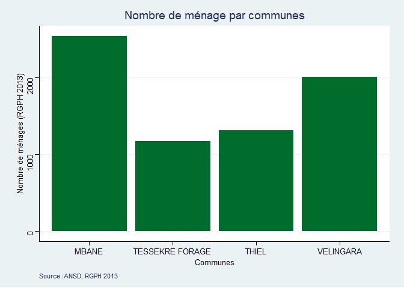

RGPH 2013 Analysis
------------------

``` r
library(readr)
library(dplyr)
```

    ## 
    ## Attaching package: 'dplyr'

    ## The following objects are masked from 'package:stats':
    ## 
    ##     filter, lag

    ## The following objects are masked from 'package:base':
    ## 
    ##     intersect, setdiff, setequal, union

``` r
POP_RGPH_2013_ANSD_LING_RAR_DAGANA <- read_delim("C:/Users/DELLDRAMOMO/Desktop/ISRA-RNU/Project datasets/data/RGPH 2013 ANSD/POP(RGPH 2013 ANSD)_LING_RAR_DAGANA.csv", 
    ";", escape_double = FALSE, trim_ws = TRUE)
```

    ## 
    ## -- Column specification --------------------------------------------------------
    ## cols(
    ##   `0@ID_REP` = col_double(),
    ##   `1@REGION` = col_character(),
    ##   `2@DEPARTEMENT` = col_character(),
    ##   `3@COMMUNE` = col_character(),
    ##   `4@CAV` = col_character(),
    ##   `5@CONCESSIONS` = col_double(),
    ##   `6@MENAGES` = col_double(),
    ##   `7@QUARTIERS-VILLAGES` = col_character(),
    ##   `8@HOMMES` = col_double(),
    ##   `9@FEMMES` = col_double(),
    ##   `10@POPULATION` = col_double(),
    ##   `11@OBSERVATIONS` = col_character()
    ## )

``` r
Population_Pastorale<-POP_RGPH_2013_ANSD_LING_RAR_DAGANA %>% 
  dplyr::filter(`3@COMMUNE` %in% c("VELINGARA","TESSEKRE FORAGE","MBANE","THIEL"))

# library(esquisse)
# 
# esquisser(Population_Pastorale)

library(dplyr)
library(ggplot2)
```

    ## Warning in as.POSIXlt.POSIXct(Sys.time()): unable to identify current timezone 'T':
    ## please set environment variable 'TZ'

``` r
Population_Pastorale %>%
 filter(!(`11@OBSERVATIONS` %in% "Non habit<e9>")) %>%
 ggplot() +
 aes(x = `3@COMMUNE`, weight = `6@MENAGES`) +
 geom_bar(fill = "#006d2c") +
 labs(x = "Communes", y = "Nombre de ménages (RGPH 2013)", title = "Nombre de ménage par communes", caption = "Source :ANSD, RGPH 2013") +
 ggthemes::theme_stata()
```



Including Plots
---------------

You can also embed plots, for example:


Note that the `echo = FALSE` parameter was added to the code chunk to
prevent printing of the R code that generated the plot.
