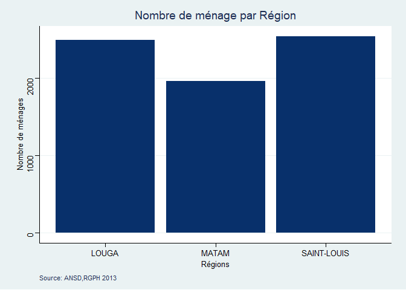
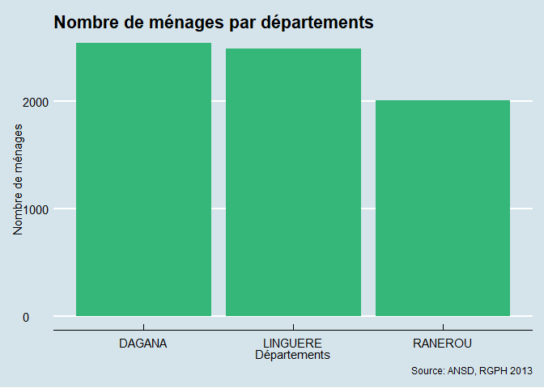
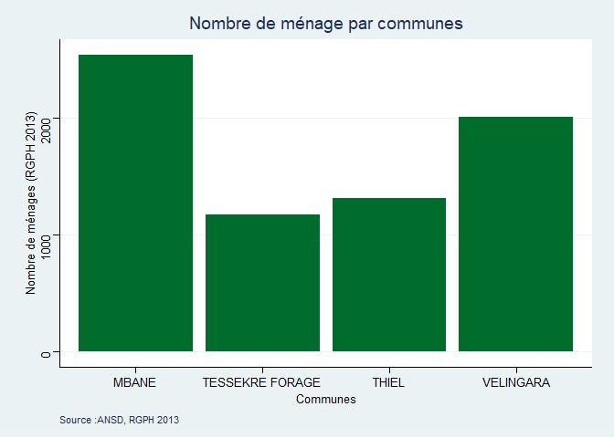

RGPH 2013 Analysis
------------------

``` r
library(readr)
library(dplyr)
library(ggplot2)
```

``` r
POP_RGPH_2013_ANSD_LING_RAR_DAGANA <- read_delim("C:/Users/DELLDRAMOMO/Desktop/ISRA-RNU/Project datasets/data/RGPH 2013 ANSD/POP(RGPH 2013 ANSD)_LING_RAR_DAGANA.csv", 
    ";", escape_double = FALSE, trim_ws = TRUE) %>% dplyr::distinct()
```

``` r
Population_Pastorale<-POP_RGPH_2013_ANSD_LING_RAR_DAGANA %>% 
  dplyr::filter(`3@COMMUNE` %in% c("VELINGARA","TESSEKRE FORAGE","MBANE","THIEL"))

write.csv2(Population_Pastorale,"Population_Pastorale.csv",row.names = F)
```

``` r
Population_Pastorale %>%
 filter(!(`11@OBSERVATIONS` %in% "Non habit<e9>")) %>%
 ggplot() +
 aes(x = `1@REGION`, weight = `6@MENAGES`) +
 geom_bar(fill = "#08306b") +
 # geom_label(data=Population_Pastorale,aes(x=`1@REGION`,y=`6@MENAGES`, label=paste0(round(`6@MENAGES`,0),"")),size=2)+
 labs(x = "Régions", y = "Nombre de ménages", title = "Nombre de ménage par Région", caption = "Source: ANSD,RGPH 2013") +
 ggthemes::theme_stata()
```



``` r
#esquisser(Population_Pastorale)


Population_Pastorale %>%
 filter(!(`11@OBSERVATIONS` %in% "Non habit<e9>")) %>%
 ggplot() +
 aes(x = `2@DEPARTEMENT`, weight = `6@MENAGES`) +
 geom_bar(fill = "#35b779") +
 labs(x = "Départements", y = "Nombre de ménages", title = "Nombre de ménages par départements", caption = "Source: ANSD, RGPH 2013") +
 ggthemes::theme_economist()
```



``` r
Population_Pastorale %>%
 filter(!(`11@OBSERVATIONS` %in% "Non habit<e9>")) %>%
 ggplot() +
 aes(x = `3@COMMUNE`, weight = `6@MENAGES`) +
 geom_bar(fill = "#006d2c") +
 labs(x = "Communes", y = "Nombre de ménages (RGPH 2013)", title = "Nombre de ménage par communes", caption = "Source :ANSD, RGPH 2013") +
 ggthemes::theme_stata()
```



| REGION      | DEPARTEMENT |     COMMUNE     | MENAGES |
|:------------|:-----------:|:---------------:|--------:|
| SAINT-LOUIS |   DAGANA    |      MBANE      |    2543 |
| MATAM       |   RANEROU   |    VELINGARA    |    1964 |
| LOUGA       |  LINGUERE   |      THIEL      |    1315 |
| LOUGA       |  LINGUERE   | TESSEKRE FORAGE |    1177 |

``` r
df<-Population_Pastorale %>% 
  dplyr::select(`1@REGION`,`2@DEPARTEMENT`,`3@COMMUNE`,`7@QUARTIERS-VILLAGES`)%>% 
  dplyr::group_by(`1@REGION`,`2@DEPARTEMENT`,`3@COMMUNE`,`7@QUARTIERS-VILLAGES`) %>% 
  dplyr::mutate(Village=n()) %>% dplyr::distinct() %>% 
  dplyr::group_by(`1@REGION`,`2@DEPARTEMENT`,`3@COMMUNE`) %>% dplyr::mutate(Village=sum(Village,na.rm = T))  %>% 
  dplyr::select(`1@REGION`,`2@DEPARTEMENT`,`3@COMMUNE`,Village)%>% dplyr::distinct()
```
