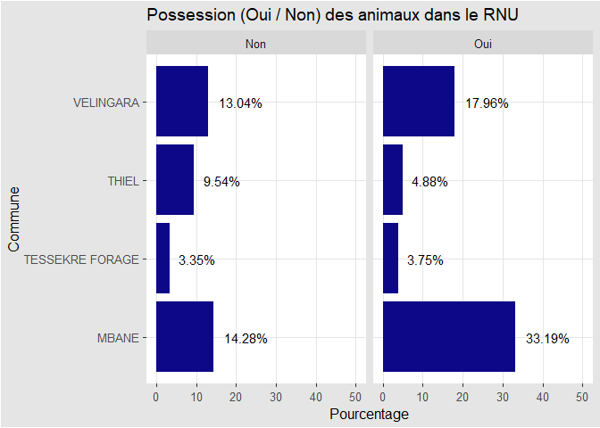
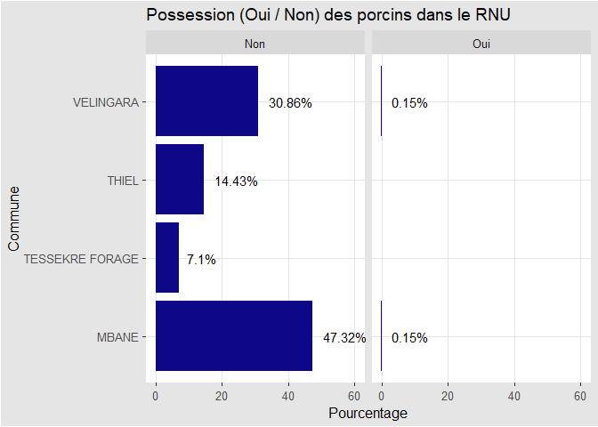

Analyse exploratoire de la base RNU
===================================

Packages R et Python nécessaires
--------------------------------

``` r
library(readxl)
library(dplyr)
library(ggplot2)
library(reticulate) #for python
library(magrittr)               # to use pipes
library(skimr)                  # to get a quick summary table
```

``` python
import matplotlib.pyplot as plt
import numpy as np
import pandas as pd 
import seaborn as sns
```

Importation des données
-----------------------

### Importation de la base RNU des départements de DAGANA et LINGUERE

``` r
RNU_DAGANA_LINGUERE <- read_excel("C:/Users/DELLDRAMOMO/Desktop/ISRA-RNU/Project datasets/data/RNU datasets/Donnee_etude_inclusion_populations_pastorales_dept_DAGANA-LINGUERE.xlsx") %>% 
  dplyr::distinct()
```

### Importation de la base RNU du département RANEROU

``` r
RNU_RANEROU <- read_excel("C:/Users/DELLDRAMOMO/Desktop/ISRA-RNU/Project datasets/data/RNU datasets/Donnee_etude_inclusion_populations_pastorales_dept_RANEROU.xlsx")%>% 
  dplyr::distinct()
```

    ## Warning in read_fun(path = enc2native(normalizePath(path)), sheet_i = sheet, :
    ## Expecting logical in IO1480 / R1480C249: got 'FAFD'

    ## Warning in read_fun(path = enc2native(normalizePath(path)), sheet_i = sheet, :
    ## Expecting logical in HE1640 / R1640C213: got 'PROBLEME DE FAMILLE'

    ## Warning in read_fun(path = enc2native(normalizePath(path)), sheet_i = sheet, :
    ## Expecting logical in IO1731 / R1731C249: got 'CECI'

    ## Warning in read_fun(path = enc2native(normalizePath(path)), sheet_i = sheet, :
    ## Expecting logical in IO1769 / R1769C249: got 'MISSA'

    ## Warning in read_fun(path = enc2native(normalizePath(path)), sheet_i = sheet, :
    ## Expecting logical in IO2035 / R2035C249: got 'MISSA'

    ## Warning in read_fun(path = enc2native(normalizePath(path)), sheet_i = sheet, :
    ## Expecting logical in N2088 / R2088C14: got 'BASSE'

Les deux bases n’ont pas les mêmes nombre de variables, nous avons
décidé de prendre les variables communes après vérifications.

``` r
var<-intersect(names(RNU_DAGANA_LINGUERE),names(RNU_RANEROU))
df1 <- RNU_DAGANA_LINGUERE %>% 
  dplyr::select(var)
```

    ## Note: Using an external vector in selections is ambiguous.
    ## i Use `all_of(var)` instead of `var` to silence this message.
    ## i See <https://tidyselect.r-lib.org/reference/faq-external-vector.html>.
    ## This message is displayed once per session.

``` r
df2 <- RNU_RANEROU %>% 
  dplyr::select(var)

df <- rbind(df1,df2)
```

Quel est le type de votre logement ? (m1)
-----------------------------------------

``` r
df <-df %>% dplyr::mutate(m1=case_when(
  m1 == 1 ~ "Case",
m1 == 2 ~ "Baraque",
m1 == 3 ~ "Maison basse",
m1 == 4 ~ "Maison à étage",
m1 == 5 ~ "Appartement dans un immeuble",
m1 == 6 ~ "Autre",

))
```

``` python
data=r.df
ax=data["m1"].value_counts().plot(kind = 'pie', autopct='%1.2f%%', figsize=(10, 10))
ax.set_title('Quel est le type de votre logement ?')
ax.set_aspect(1) # make it round 
ax.set_ylabel('') # remove default 
plt.show()
```


Quel est le statut d’occupation du logement de votre ménage ? (m2)
------------------------------------------------------------------

``` r
df <-df %>% dplyr::mutate(m2=case_when(
  m2 == 1 ~ "Propriétaire sans titre",
m2 == 2 ~ "Propriétaire avec titre",
m2 == 3 ~ "Locataire simple",
m2 == 4 ~ "Locataire acheteur",
m2 == 5 ~ "Logé par l’employeur",
m2 == 6 ~ "Logé gratuitement par un parent/ami",
m2 == 7 ~ "Autre"

))
```

``` python
data=r.df
ax=data["m2"].value_counts().plot(kind = 'pie', autopct='%1.2f%%', figsize=(10, 10))
ax.set_title('Quel est le statut d'' occupation du logement de votre ménage ?')
ax.set_aspect(1) # make it round 
ax.set_ylabel('') # remove default 
plt.show()
```


Combien de piéces séparées à usage d’habitation y a-t-il dans votre logement ? (m3)
-----------------------------------------------------------------------------------

Quelle est la nature ou le revêtement du toit du principal batiment de votre logement ? (m4)
--------------------------------------------------------------------------------------------

``` r
df <-df %>% dplyr::mutate(m4=case_when(
  m4 == 1 ~ "Béton/ciment",
m4 == 2 ~ "Tuile/ardoise",
m4 == 3 ~ "Zinc",
m4 == 4 ~ "Chaume/paille",
m4 == 5 ~ "Autre"

))
```

``` python
data=r.df
ax=data["m4"].value_counts().plot(kind = 'pie', autopct='%1.2f%%', figsize=(10, 10))
ax.set_title('Quelle est la nature ou le revêtement du toit du principal batiment de votre logement ?')
ax.set_aspect(1) # make it round 
ax.set_ylabel('') # remove default 
plt.show()
```


Quelle est la nature ou le revêtement du sol du principal batiment de votre logement ? (m5)
-------------------------------------------------------------------------------------------

``` r
df <-df %>% dplyr::mutate(m5=case_when(
m5 == 1 ~ "Ciment",
m5 == 2 ~ "Carreau",
m5 == 3 ~ "Banco",
m5 == 4 ~ "Sable",
m5 == 5 ~ "Tapis",
m5 == 6 ~ "Moquette",
m5 == 7 ~ "Bois Ciré",
m5 == 8 ~ "Autre"
))
```

``` python
data=r.df
ax=data["m5"].value_counts().plot(kind = 'pie', autopct='%1.2f%%', figsize=(10, 10))
ax.set_title('Quelle est la nature ou le revêtement du sol du principal batiment de votre logement ?')
ax.set_aspect(1) # make it round 
ax.set_ylabel('') # remove default 
plt.show()
```


Quelle est la nature ou le revêtement des murs du principal batiment de votre logement ? (m6)
---------------------------------------------------------------------------------------------

``` r
df <-df %>% dplyr::mutate(m6=case_when(
  m6 == 1 ~ "Briques en ciment",
m6 == 2 ~ "Carreau",
m6 == 3 ~ "Briques en banco",
m6 == 4 ~ "Bois",
m6 == 5 ~ "Tôle en métal",
m6 == 6 ~ "Pisé",
m6 == 7 ~ "Paille/tige",
m6 == 8 ~ "Autre"

))
```

``` python
data=r.df
ax=data["m6"].value_counts().plot(kind = 'pie', autopct='%1.2f%%', figsize=(10, 10))
ax.set_title('Quelle est la nature ou le revêtement des murs du principal batiment de votre logement ?')
ax.set_aspect(1) # make it round 
ax.set_ylabel('') # remove default 
plt.show()
```


Quelle est la principale source d’éclairage qu’utilise votre ménage ?
---------------------------------------------------------------------

``` r
df <-df %>% dplyr::mutate(m7=case_when(
  m7 == 1 ~ "Electricité (Sénélec)",
m7 == 2 ~ "Groupe électrogène",
m7 == 3 ~ "Solaire",
m7 == 4 ~ "Lampe à gaz",
m7 == 5 ~ "Lampe tempête",
m7 == 6 ~ "Lampe à pétrole artisanale",
m7 == 7 ~ "Lampe rechargeable",
m7 == 8 ~ "Lampe Torche",
m7 == 9 ~ "Bougie",
m7 == 10 ~ "Bois",
m7 == 11 ~ "Autre"

))
```

``` python
data=r.df
ax=data["m7"].value_counts().plot(kind = 'pie', autopct='%1.2f%%', figsize=(10, 10))
ax.set_title('Quelle est la principale source d''éclairage qu''utilise votre ménage ?')
ax.set_aspect(1) # make it round 
ax.set_ylabel('') # remove default 
plt.show()
```


Quelle est la principale combustible qu’utilise votre ménage pour la cuisson ? (m8)
-----------------------------------------------------------------------------------

``` r
df <-df %>% dplyr::mutate(m8=case_when(
  m8 == 1 ~ "Charbon de bois",
m8 == 2 ~ "Bois de chauffe",
m8 == 3 ~ "Gaz",
m8 == 4 ~ "Electricité",
m8 == 5 ~ "Déchet d’animaux",
m8 == 6 ~ "Autre"

))
```

``` python
data=r.df
ax=data["m8"].value_counts().plot(kind = 'pie', autopct='%1.2f%%', figsize=(10, 10))
ax.set_title('Quelle est la principale combustible qu''utilise votre ménage pour la cuisson ?')
ax.set_aspect(1) # make it round 
ax.set_ylabel('') # remove default 
plt.show()
```


Quel type de toilettes les membres de votre ménage utilisent-t-ils principalement ? (m9)
----------------------------------------------------------------------------------------

``` r
df <-df %>% dplyr::mutate(m9=case_when(
  m9 == 1 ~ "Chasse d’eau avec égout",
m9 == 2 ~ "Chasse d’eau avec fosse septique",
m9 == 3 ~ "Latrines couvertes",
m9 == 4 ~ "Latrines ventilées améliorées",
m9 == 5 ~ "Latrines non couvertes",
m9 == 6 ~ "Cuvette/seau",
m9 == 7 ~ "Edicule public",
m9 == 8 ~ "Chez le voisin",
m9 == 9 ~ "Chez le voisin",
m9 == 10 ~ "Dans la nature",
m9 == 11 ~ "Autre"

))
```

``` python
data=r.df
ax=data["m9"].value_counts().plot(kind = 'pie', autopct='%1.2f%%', figsize=(10, 10))
ax.set_title('Quel type de toilettes les membres de votre ménage utilisent-t-ils principalement ?')
ax.set_aspect(1) # make it round 
ax.set_ylabel('') # remove default 
plt.show()
```


Quelle est la principale source de l’eau que boivent les membres de votre ménage? (m10)
---------------------------------------------------------------------------------------

``` r
df <-df %>% dplyr::mutate(m10=case_when(
  m10 == 1 ~ "Robinet intérieur",
m10 == 2 ~ "Robinet public",
m10 == 3 ~ "Robinet du voisin",
m10 == 4 ~ "Puits protégé",
m10 == 5 ~ "Puits non protégé",
m10 == 6 ~ "Forage motorisé",
m10 == 7 ~ "Forage à pompe manuel",
m10 == 8 ~ "Service de camion-citerne",
m10 == 9 ~ "Service de camion-citerne",
m10 == 10 ~ "Eau minérale / Filtrée",
m10 == 11 ~ "Vendeur d’eau",
m10 == 12 ~ "Autre"

))
```

``` python
data=r.df
ax=data["m10"].value_counts().plot(kind = 'pie', autopct='%1.2f%%', figsize=(10, 10))
ax.set_title('Quelle est la principale source de l’eau que boivent les membres de votre ménage?')
ax.set_aspect(1) # make it round 
ax.set_ylabel('') # remove default 
plt.show()
```


Votre ménage possède-t-il les biens et équipements suivants ? (m11a à m11o)
---------------------------------------------------------------------------

Votre ménage possède-t-il les moyens de production suivants ? (m12a à m12s)
---------------------------------------------------------------------------

Quelle est la principale source de revenu de votre ménage ? (m13)
-----------------------------------------------------------------

``` r
df <- df %>% 
  dplyr::mutate(m13=case_when(
    m13==1 ~ "Salaires",
    m13==2 ~ "Pension de retraite",
    m13==3 ~ "Revenus de l'agriculture",
    m13==4 ~ "Revenu de l'élevage",
    m13==5 ~ "Revenu de la pêche",
    m13==6 ~ "Revenus des activités non agricoles",
    m13==7 ~ "Revenus locatives",
    m13==8 ~ "Transferts",
    m13==9 ~ "Autre"
  ))
```

``` python
data=r.df
ax=data["m13"].value_counts().plot(kind = 'pie', autopct='%1.2f%%', figsize=(10, 10))
ax.set_title('Quelle est la principale source de revenu de votre ménage ?')
ax.set_aspect(1) # make it round 
ax.set_ylabel('') # remove default 
plt.show()
```


Combien de têtes de \[espèce\] votre ménage possède-t-il actuellement ? (m14)
-----------------------------------------------------------------------------

Nous avons créer deux variables: - une variable **animaux** qui est
égale à la somme des variables **m14a à m14h** - la variable **m14_bis**
vaut **Oui** si **animaux \>0** et **Non** dans le cas contraire.

``` r
df <- df %>% 
  dplyr::mutate(animaux=purrr::pmap(list(m14a,m14b,m14c,m14d,m14e,m14f,m14g,m14h),sum,na.rm=T))

df <- df %>% 
  dplyr::mutate(m14_bis = ifelse(animaux>0,"Oui","Non"))
```

``` python
data=r.df
ax=data["m14_bis"].value_counts().plot(kind = 'pie', autopct='%1.2f%%', figsize=(10, 10))
ax.set_title('Possession d''animaux')
ax.set_aspect(1) # make it round 
ax.set_ylabel('') # remove default 
plt.show()
```


Quelle est la superficie totale (en hectare) cultivée et/ou plantée par votre ménage lors de la campagne passée ? (m15a à m15g )
--------------------------------------------------------------------------------------------------------------------------------

La variable **m15** vaut **1** si le ménage a cultivé au moins: Arachide
,Mil, Mais, Riz, Autres Céréales, Autres Cultures et **2** sinon.

M15. Votre ménage pratique t-il l’agriculture? ( oui=1 non=2). Si non, passer à M19 (m15)
-----------------------------------------------------------------------------------------

``` r
df <- df %>% 
  dplyr::mutate(m15=case_when(
    m15==1 ~ "Oui",
    m15==2 ~ "Non"
  ))
```

``` python
data=r.df
ax=data["m15"].value_counts().plot(kind = 'pie', autopct='%1.2f%%', figsize=(10, 10))
ax.set_title('Votre ménage pratique t-il l''agriculture?')
ax.set_aspect(1) # make it round 
ax.set_ylabel('') # remove default 
plt.show()
```


Quelle est la superficie totale (en hectare) cultivée et/ou plantée uniquement par les femmes lors de la campagne passée ? (m16)
--------------------------------------------------------------------------------------------------------------------------------

Quelle est la surface qui appartient au ménage? (m17)
-----------------------------------------------------

Quelle est la surface qui appartient uniquement aux femmes?(m18)
----------------------------------------------------------------

Au cours des 7 derniers jours, pendant combien de jours votre ménage a-t-il consommé les aliments suivants au cours des repas familiaux et quelle est la principale source de ces aliments ?(m19a1 à m19b18)
------------------------------------------------------------------------------------------------------------------------------------------------------------------------------------------------------------

Combien de jours au cours des 7 derniers jours, votre ménage a-t-il dû recourir aux stratégies suivantes pour faire face à des difficultés alimentaires: (m20…)
---------------------------------------------------------------------------------------------------------------------------------------------------------------

Aucours des 12 derniers mois, votre ménage a-t-il été victime des problèmes suivants ayant considérablement grévé ses revenus et quelles sont les stratégies qui ont été adoptées face à ces problémes ? (m21… variable à revoir)
---------------------------------------------------------------------------------------------------------------------------------------------------------------------------------------------------------------------------------

``` r
possession <- function(x) (ifelse(x==0,"Non","Oui"))
df_RNU_DAGANA_LINGUERE <-RNU_DAGANA_LINGUERE %>% 
  dplyr::filter(nom_commune_men %in% c("VELINGARA","TESSEKRE FORAGE","MBANE","THIEL")) %>% 
  dplyr::select(nom_region_men,nom_departement_men,nom_commune_men,milieu_de_residence,m13,dplyr::starts_with("m14")) %>% 
  dplyr::mutate_at(vars(dplyr::starts_with("m14_")),as.factor) %>% 
  dplyr::mutate_at(vars(dplyr::starts_with("m14_")),possession) %>% 
  dplyr::mutate(animaux=purrr::pmap(list(m14a,m14b,m14c,m14d,m14e,m14f,m14g,m14h),sum,na.rm=T))

possession <- function(x) (ifelse(x==1,"Non","Oui"))
df_RNU_RANEROU<-RNU_RANEROU %>% 
  dplyr::filter(nom_commune_men %in% c("VELINGARA","TESSEKRE FORAGE","MBANE","THIEL")) %>% 
  dplyr::select(nom_region_men,nom_departement_men,nom_commune_men,milieu_de_residence,m13,dplyr::starts_with("m14")) %>% 
  dplyr::select(nom_region_men,nom_departement_men,nom_commune_men,milieu_de_residence,m13,dplyr::starts_with("m14")) %>% 
  dplyr::mutate_at(vars(dplyr::starts_with("m14_")),as.factor) %>% 
  dplyr::mutate_at(vars(dplyr::starts_with("m14_")),possession) %>% 
  dplyr::mutate(animaux=purrr::pmap(list(m14a,m14b,m14c,m14d,m14e,m14f,m14g,m14h),sum,na.rm=T))

df<-rbind(df_RNU_DAGANA_LINGUERE,df_RNU_RANEROU)

df <- df %>% 
  dplyr::mutate(possession = ifelse(animaux>0,"Oui","Non"))
```

``` r
ggplot(data=df %>% 
  dplyr::group_by(nom_region_men,nom_departement_men,nom_commune_men,possession) %>% 
  dplyr::mutate(n=n()) %>% 
  dplyr::mutate(prop=round(n * 100/2745,2)) %>% 
  dplyr::select(nom_region_men,nom_departement_men,nom_commune_men,possession,prop) %>%
  dplyr::distinct(),aes(x = nom_commune_men, y = prop)) +
 geom_bar(stat="identity",position = "dodge", fill = "#0d0887")  +
  geom_text(aes(label=paste0(prop,"%")), position=position_dodge(width=0.9), hjust=-0.25) +
 labs(x = "Commune", y = "Pourcentage", title = "Possession (Oui / Non) des animaux dans le RNU") +
 coord_flip() +
 ggthemes::theme_igray() +
 facet_wrap(vars(possession), scales = "fixed")+
 ylim(0L, 50L)
```



``` r
#esquisser(rs)
```

``` python
data=r.df
ax=data["possession"].value_counts().plot(kind = 'pie', autopct='%1.2f%%', figsize=(10, 10))
ax.set_title('Proportion de ménages possèdant des animaux')
ax.set_aspect(1) # make it round 
ax.set_ylabel('') # remove default 
fig = ax.figure 
fig.set_size_inches(8, 8)
plt.show()
```


``` r
ggplot(data=df %>% 
  dplyr::group_by(nom_region_men,nom_departement_men,nom_commune_men,m14_1) %>% 
  dplyr::mutate(n=n()) %>% 
  dplyr::mutate(prop=round(n * 100/2745,2)) %>% 
  dplyr::select(nom_region_men,nom_departement_men,nom_commune_men,m14_1,prop) %>%
  dplyr::distinct(),aes(x = nom_commune_men, y = prop)) +
 geom_bar(stat="identity",position = "dodge", fill = "#0d0887")  +
  geom_text(aes(label=paste0(prop,"%")), position=position_dodge(width=0.9), hjust=-0.25) +
 labs(x = "Commune", y = "Pourcentage", title = "Possession (Oui / Non) des bovins dans le RNU") +
 coord_flip() +
 ggthemes::theme_igray() +
 facet_wrap(vars(m14_1), scales = "fixed")+
 ylim(0L, 40L)
```


``` python
data=r.df
ax=data["m14_1"].value_counts().plot(kind = 'pie', autopct='%1.2f%%', figsize=(10, 10))
ax.set_title('Proportion de ménages possèdant des bovins (Bœufs, Vaches)')
ax.set_aspect(1) # make it round 
ax.set_ylabel('') # remove default 
fig = ax.figure 
fig.set_size_inches(8, 8)
plt.show()
```


``` r
ggplot(data=df %>% 
  dplyr::group_by(nom_region_men,nom_departement_men,nom_commune_men,m14_2) %>% 
  dplyr::mutate(n=n()) %>% 
  dplyr::mutate(prop=round(n * 100/2745,2)) %>% 
  dplyr::select(nom_region_men,nom_departement_men,nom_commune_men,m14_2,prop) %>%
  dplyr::distinct(),aes(x = nom_commune_men, y = prop)) +
 geom_bar(stat="identity",position = "dodge", fill = "#0d0887")  +
  geom_text(aes(label=paste0(prop,"%")), position=position_dodge(width=0.9), hjust=-0.25) +
 labs(x = "Commune", y = "Pourcentage", title = "Possession (Oui / Non) des caprins dans le RNU") +
 coord_flip() +
 ggthemes::theme_igray() +
 facet_wrap(vars(m14_2), scales = "fixed")+
 ylim(0L, 40L)
```


``` python
data=r.df
ax=data["m14_2"].value_counts().plot(kind = 'pie', autopct='%1.2f%%', figsize=(10, 10))
ax.set_title('Proportion de ménages possèdant des caprins')
ax.set_aspect(1) # make it round 
ax.set_ylabel('') # remove default 
fig = ax.figure 
fig.set_size_inches(8, 8)
plt.show()
```


``` r
ggplot(data=df %>% 
  dplyr::group_by(nom_region_men,nom_departement_men,nom_commune_men,m14_3) %>% 
  dplyr::mutate(n=n()) %>% 
  dplyr::mutate(prop=round(n * 100/2745,2)) %>% 
  dplyr::select(nom_region_men,nom_departement_men,nom_commune_men,m14_3,prop) %>%
  dplyr::distinct(),aes(x = nom_commune_men, y = prop)) +
 geom_bar(stat="identity",position = "dodge", fill = "#0d0887")  +
  geom_text(aes(label=paste0(prop,"%")), position=position_dodge(width=0.9), hjust=-0.25) +
 labs(x = "Commune", y = "Pourcentage", title = "Possession (Oui / Non) des ovins dans le RNU") +
 coord_flip() +
 ggthemes::theme_igray() +
 facet_wrap(vars(m14_3), scales = "fixed")+
 ylim(0L, 40L)
```


``` python
data=r.df
ax=data["m14_3"].value_counts().plot(kind = 'pie', autopct='%1.2f%%', figsize=(10, 10))
ax.set_title('Proportion de ménages possèdant des ovins')
ax.set_aspect(1) # make it round 
ax.set_ylabel('') # remove default 
fig = ax.figure 
fig.set_size_inches(8, 8)
plt.show()
```


``` r
ggplot(data=df %>% 
  dplyr::group_by(nom_region_men,nom_departement_men,nom_commune_men,m14_4) %>% 
  dplyr::mutate(n=n()) %>% 
  dplyr::mutate(prop=round(n * 100/2745,2)) %>% 
  dplyr::select(nom_region_men,nom_departement_men,nom_commune_men,m14_4,prop) %>%
  dplyr::distinct(),aes(x = nom_commune_men, y = prop)) +
 geom_bar(stat="identity",position = "dodge", fill = "#0d0887")  +
  geom_text(aes(label=paste0(prop,"%")), position=position_dodge(width=0.9), hjust=-0.25) +
 labs(x = "Commune", y = "Pourcentage", title = "Possession (Oui / Non) des volailles dans le RNU") +
 coord_flip() +
 ggthemes::theme_igray() +
 facet_wrap(vars(m14_4), scales = "fixed")+
 ylim(0L, 60L)
```


``` python
data=r.df
ax=data["m14_4"].value_counts().plot(kind = 'pie', autopct='%1.2f%%', figsize=(10, 10))
ax.set_title('Proportion de ménages possèdant des volailles')
ax.set_aspect(1) # make it round 
ax.set_ylabel('') # remove default 
fig = ax.figure 
fig.set_size_inches(8, 8)
plt.show()
```


``` r
ggplot(data=df %>% 
  dplyr::group_by(nom_region_men,nom_departement_men,nom_commune_men,m14_5) %>% 
  dplyr::mutate(n=n()) %>% 
  dplyr::mutate(prop=round(n * 100/2745,2)) %>% 
  dplyr::select(nom_region_men,nom_departement_men,nom_commune_men,m14_5,prop) %>%
  dplyr::distinct(),aes(x = nom_commune_men, y = prop)) +
 geom_bar(stat="identity",position = "dodge", fill = "#0d0887")  +
  geom_text(aes(label=paste0(prop,"%")), position=position_dodge(width=0.9), hjust=-0.25) +
 labs(x = "Commune", y = "Pourcentage", title = "Possession (Oui / Non) des porcins dans le RNU") +
 coord_flip() +
 ggthemes::theme_igray() +
 facet_wrap(vars(m14_5), scales = "fixed")+
 ylim(0L, 60L)
```



``` python
data=r.df
ax=data["m14_5"].value_counts().plot(kind = 'pie', autopct='%1.2f%%', figsize=(10, 10))
ax.set_title('Proportion de ménages possèdant des porcins')
ax.set_aspect(1) # make it round 
ax.set_ylabel('') # remove default 
fig = ax.figure 
fig.set_size_inches(8, 8)
plt.show()
```


``` r
ggplot(data=df %>% 
  dplyr::group_by(nom_region_men,nom_departement_men,nom_commune_men,m14_6) %>% 
  dplyr::mutate(n=n()) %>% 
  dplyr::mutate(prop=round(n * 100/2745,2)) %>% 
  dplyr::select(nom_region_men,nom_departement_men,nom_commune_men,m14_6,prop) %>%
  dplyr::distinct(),aes(x = nom_commune_men, y = prop)) +
 geom_bar(stat="identity",position = "dodge", fill = "#0d0887")  +
  geom_text(aes(label=paste0(prop,"%")), position=position_dodge(width=0.9), hjust=-0.25) +
 labs(x = "Commune", y = "Pourcentage", title = "Possession (Oui / Non) des chevaux/juments dans le RNU") +
 coord_flip() +
 ggthemes::theme_igray() +
 facet_wrap(vars(m14_6), scales = "fixed")+
 ylim(0L, 60L)
```


``` python
data=r.df
ax=data["m14_6"].value_counts().plot(kind = 'pie', autopct='%1.2f%%', figsize=(10, 10))
ax.set_title('Proportion de ménages possèdant des chevaux/juments')
ax.set_aspect(1) # make it round 
ax.set_ylabel('') # remove default 
fig = ax.figure 
fig.set_size_inches(8, 8)
plt.show()
```


``` r
ggplot(data=df %>% 
  dplyr::group_by(nom_region_men,nom_departement_men,nom_commune_men,m14_7) %>% 
  dplyr::mutate(n=n()) %>% 
  dplyr::mutate(prop=round(n * 100/2745,2)) %>% 
  dplyr::select(nom_region_men,nom_departement_men,nom_commune_men,m14_7,prop) %>%
  dplyr::distinct(),aes(x = nom_commune_men, y = prop)) +
 geom_bar(stat="identity",position = "dodge", fill = "#0d0887")  +
  geom_text(aes(label=paste0(prop,"%")), position=position_dodge(width=0.9), hjust=-0.25) +
 labs(x = "Commune", y = "Pourcentage", title = "Possession (Oui / Non) des ânes dans le RNU") +
 coord_flip() +
 ggthemes::theme_igray() +
 facet_wrap(vars(m14_7), scales = "fixed")+
 ylim(0L, 40L)
```


``` python
data=r.df
ax=data["m14_7"].value_counts().plot(kind = 'pie', autopct='%1.2f%%', figsize=(10, 10))
ax.set_title('Proportion de ménages possèdant des ânes')
ax.set_aspect(1) # make it round 
ax.set_ylabel('') # remove default 
fig = ax.figure 
fig.set_size_inches(8, 8)
plt.show()
```


``` r
df <- df %>% 
  dplyr::mutate(m13=case_when(
    m13==1 ~ "Salaires",
    m13==2 ~ "Pension de retraite",
    m13==3 ~ "Revenus de l'agriculture",
    m13==4 ~ "Revenu de l'élevage",
    m13==5 ~ "Revenu de la pêche",
    m13==6 ~ "Revenus des activités non agricoles",
    m13==7 ~ "Revenus locatives",
    m13==8 ~ "Transferts",
    m13==9 ~ "Autre"
  ))
```

``` python
data=r.df
ax=data["m13"].value_counts().plot(kind = 'pie', autopct='%1.2f%%', figsize=(10, 10))
ax.set_title('Activités principales des ménages')
ax.set_aspect(1) # make it round 
ax.set_ylabel('') # remove default 
fig = ax.figure 
fig.set_size_inches(8, 8)
plt.show()
```


``` r
df <- df %>% 
  dplyr::mutate(m13=case_when(
    m13=="Salaires" ~ "Autre",
    m13=="Revenus de l'agriculture" ~ "Revenus de l'agriculture",
    m13=="Revenu de l'élevage" ~ "Revenu de l'élevage",
    m13=="Pension de retraite" ~ "Autre",
    m13=="Revenu de la pêche" ~ "Autre",
    m13=="Revenus des activités non agricoles" ~ "Revenus des activités non agricoles",
    m13=="Revenus locatives" ~ "Autre",
    m13=="Transferts" ~ "Autre",
    m13=="Autre" ~ "Autre"
  ))
```

``` python
data=r.df
ax=data["m13"].value_counts().plot(kind = 'pie', autopct='%1.2f%%', figsize=(10, 10))
ax.set_title('Activités principales des ménages')
ax.set_aspect(1) # make it round 
ax.set_ylabel('') # remove default 
fig = ax.figure 
fig.set_size_inches(8, 8)
plt.show()
```


