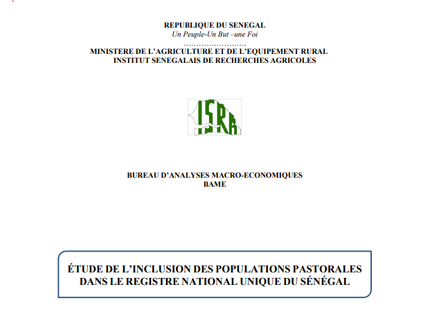
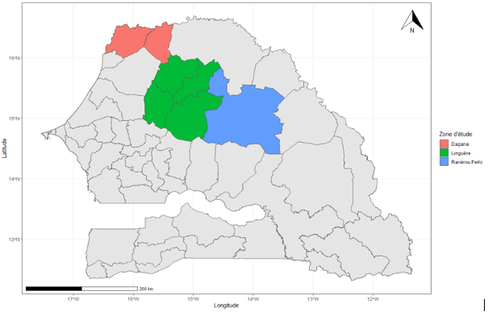

# ISRA-RNU
 
 
 ## Aim of the study
 
 The aim of the study is to analyse the current process of building the RNU in Senegal and to measure its effective degree of inclusiveness in relation to vulnerable pastoral populations.
 More specifically, this expertise aims to :
 
 - evaluate the process of RNU and the inclusion of pastoralists;

 - to analyse and compare by sampling the current covarage of the social register with regard to the situation of pastoral populations in defined locations;

 - to make recommendations to decision-makers and partners in the process initiated by the Government of Senegal to extend the RNU to the poorest and most vulnerable pastoral populations.

This understanding of the mission will help answer these key questions in the end:

  1 - Does the targeting process (community identification, socio-economic survey) identify poor pastoralist households in the same way as other poor households? For a given area, does the RNU correctly reflect the proportion of poor pastoral households?
    
      - Comparison of the % exclusion errors in the pastoral population with % exclusion errors (based on PMT) in the non-pastoral population.
      - Comparison of PMT score between RNU and non-RNU pastoralists.
      
  2 - What are the characteristics of pastoral households in the RNU? Do these characteristics meet the indicators of pastoral vulnerability?
  
      - Comparison of socio-demographics variables between RNU and non-RNU pastoralists.
      - Comparison of vulnerability score between RNU and non-RNU pastoralists.
      - Critical analysis of the variables of the single sheet and reasonable proposal of adaptation for a future iteration of the RNU.
      
  3 - What are the potential biases that may lead to lack of consideration of pastoral households in the process?
  
      - Process evaluation (community identification, socio-economic survey.

## Expected deliverables

Beyond the exchanges that will be organized with the main technical and financial partners of the implementation of RNU, the animation, the elaboration of tools and approaches, as well as the animation of field activities, the products expected at the end of this expertise, must correspond to the five following deliverables :

*Deleverable 1: An inception report presenting the mapping of RNU households and the sampling and data collection protocol*;

*Deliverable 2 Interview guides, for focus group and field interviews, household survey questionnaire and planning of field activities*;

*Deliverable 3: The analysis report of the UNR process and its implementation*;

*Deliverable 4: The analysis report on the degree of inclusion of vulnerable pastoral populations (already delivered to the technical committee)*;

*Deliverable 5: A final report of the study, with operational recommendations, validated by the technical committee*.

## Sampling method

## Study area

## Survey frame

In this study two sampling frames are used:
  - The RNU database: in this database pastoral households will be drawn to make an initial analysis of their vulnerability profile;
  - The ANSD database of pastoral areas: this is used to target true pastoral areas to calculate the proportion of vulnerable pastoral households.
 
## Calculation of the sample size

Sample size (in terms of number of pastoral households) is set according to the formula for estimating a proportion.
The sample size formula for estimating a proportion is as follows:

  

Using a correction factor of   relating to small populations, we get:

where :

 - **N** is the total number of pastoral households, equal to 6999 (the number of pastoral households in the communes of Velingara in Ranérou, Tesseekré and Thieul in Linguère and Mbane in Dagana, RGPH 2013, ANSD);
 - **p** is the proportion of vulnerable pastoral households. To ensure that the sample is representative, we set **p=0.5** ;
 - **e** is the margin of error or accuracy level set at **5%**;
 - is equal to 2.326 for α fixed with a threshold of 98% (two-tailed test);

